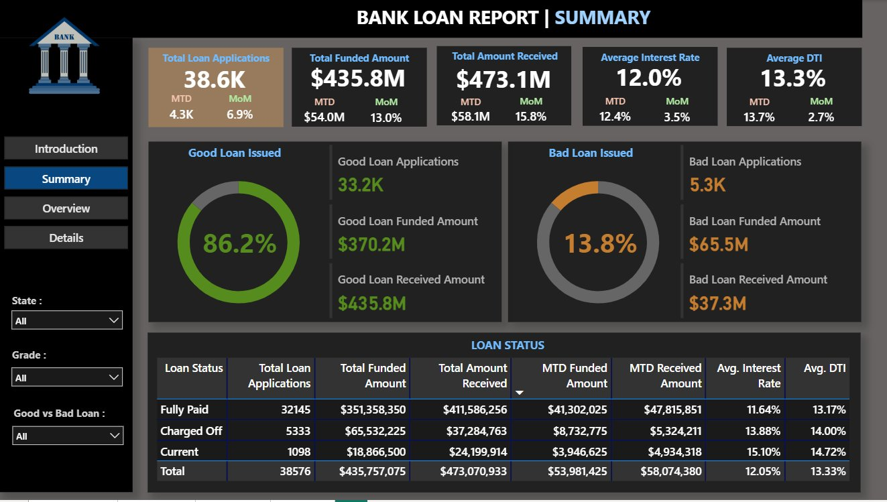
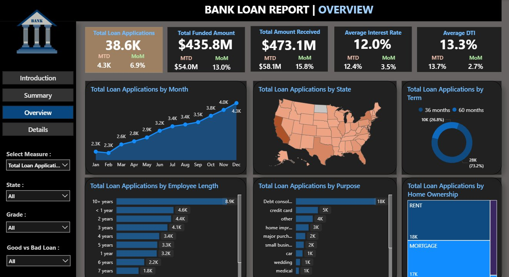
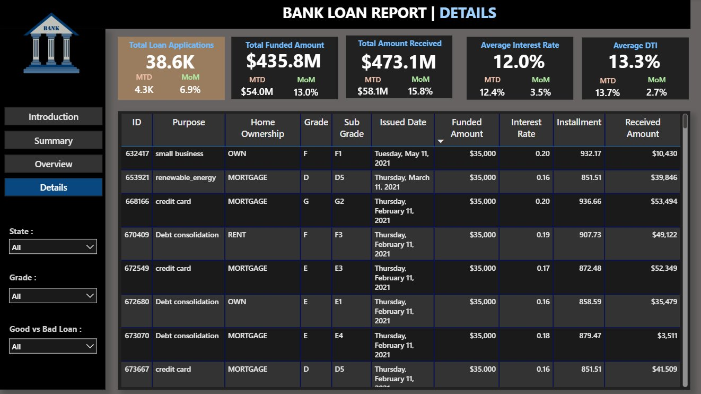

# 🏦 Bank Loan Data Insights — Power BI Dashboard

> An interactive Power BI dashboard for analyzing bank loan portfolios, tracking loan performance, identifying risk patterns, and monitoring repayment trends across borrower segments.

---

## 📌 Table of Contents

- [Overview](#overview)
- [Dashboard Screenshots](#dashboard-screenshots)
- [Features](#features)
- [Key Metrics & KPIs](#key-metrics--kpis)
- [File Structure](#file-structure)
- [Getting Started](#getting-started)
- [Data Model](#data-model)
- [Requirements](#requirements)
- [Contributing](#contributing)
- [License](#license)

---

## Overview

The **Bank Loan Data Insights** dashboard is built using **Power BI Template (`.pbit`)** format. It provides a comprehensive 4-page report enabling analysts, risk officers, and business stakeholders to:

- Monitor **38.6K** total loan applications worth **$435.8M** funded
- Track **Good Loans (86.2%)** vs **Bad Loans (13.8%)** in real time
- Segment borrowers by grade, employment length, home ownership, and purpose
- Analyze geographic loan distribution across all US states
- Drill into individual loan records with full details

---

## Dashboard Screenshots

### 📊 Page 1 — Summary


> High-level KPIs with Good Loan vs Bad Loan breakdown and Loan Status table.

---

### 🗺️ Page 2 — Overview


> Monthly trends, US state map, loan purpose breakdown, employee length analysis, term split, and home ownership distribution.

---

### 📋 Page 3 — Details


> Full drill-through table with individual loan records — ID, purpose, grade, sub-grade, funded amount, interest rate, installment, and received amount.

---

## Features

| Feature | Description |
|---|---|
| 📊 Summary Page | KPI cards — Total Applications (38.6K), Funded ($435.8M), Received ($473.1M), Avg Interest (12%), Avg DTI (13.3%) |
| ✅ Good vs Bad Loan | Good Loan 86.2% ($370.2M funded) vs Bad Loan 13.8% ($65.5M funded) |
| 📉 Loan Status Table | Fully Paid / Charged Off / Current breakdown with MTD and MoM comparisons |
| 📈 Monthly Trend | Line chart showing loan growth from Jan (2.3K) to Dec (4.0K) |
| 🗺️ Geographic Map | Loan distribution across all US states with color intensity |
| 🍩 Term Analysis | 36-month (26.8%) vs 60-month (73.2%) loan term split |
| 👤 Borrower Profile | Segmentation by employment length, purpose, and home ownership |
| 🔍 Details Drill-through | Full individual loan record table with all fields |
| 🎛️ Interactive Slicers | Filter by State, Grade, and Good vs Bad Loan |

---

## Key Metrics & KPIs

| Metric | Value |
|---|---|
| Total Loan Applications | 38,576 |
| Total Funded Amount | $435,757,075 |
| Total Amount Received | $473,070,933 |
| Average Interest Rate | 12.05% |
| Average DTI | 13.33% |
| Good Loan % | 86.2% (33.2K applications) |
| Bad Loan % | 13.8% (5.3K applications) |
| Fully Paid Loans | 32,145 |
| Charged Off Loans | 5,333 |
| Current Loans | 1,098 |
| MTD Funded Amount | $53,981,425 |
| MoM Growth (Applications) | +6.9% |
| MoM Growth (Amount Received) | +15.8% |

---

## File Structure

```
📁 bank-loan-data-insights/
│
├── 📄 README.md                          ← Project documentation
├── 📊 Bank_Loan_Data_Insights.pbit       ← Power BI Template file
└── 📁 screenshots/                       ← Dashboard preview images
    ├── screenshot_summary.png
    ├── screenshot_overview.png
    └── screenshot_details.png
```

---

## Getting Started

### Prerequisites

- [Power BI Desktop](https://powerbi.microsoft.com/desktop/) — Free download from Microsoft
- Windows 10 / 11
- Your loan dataset in CSV, Excel, or SQL Server format

### Step 1 — Clone or Download

```bash
git clone https://github.com/YOUR_USERNAME/bank-loan-data-insights.git
```

Or click **Code → Download ZIP** on this page.

### Step 2 — Open the Template

1. Launch **Power BI Desktop**
2. Go to **File → Open → Browse**
3. Select `Bank_Loan_Data_Insights.pbit`
4. Power BI will prompt you to connect a data source

### Step 3 — Connect Your Data

- **CSV/Excel**: Go to Transform Data → Data Source Settings → browse to your file
- **SQL Server**: Enter server name, database, and credentials

### Step 4 — Refresh

Click **Home → Refresh** — all 4 pages will populate with your data automatically.

---

## Data Model

| Column | Data Type | Description |
|---|---|---|
| `id` | Integer | Unique loan identifier |
| `loan_amount` | Decimal | Total loan amount |
| `funded_amount` | Decimal | Amount actually funded |
| `interest_rate` | Decimal | Annual interest rate (%) |
| `installment` | Decimal | Monthly payment |
| `grade` | Text | Loan grade (A–G) |
| `sub_grade` | Text | Sub-grade (A1–G5) |
| `emp_length` | Text | Employment length |
| `home_ownership` | Text | RENT / OWN / MORTGAGE |
| `annual_income` | Decimal | Borrower annual income |
| `loan_status` | Text | Fully Paid / Charged Off / Current |
| `purpose` | Text | Loan purpose |
| `dti` | Decimal | Debt-to-income ratio |
| `addr_state` | Text | US state code |
| `issue_date` | Date | Loan issue date |
| `total_payment` | Decimal | Total payment received |

---

## Requirements

| Requirement | Version |
|---|---|
| Power BI Desktop | March 2023 or later |
| Operating System | Windows 10 / 11 |
| RAM | 4 GB minimum, 8 GB recommended |

---

## Contributing

Contributions are welcome!

1. Fork this repository
2. Create a new branch: `git checkout -b feature/your-feature-name`
3. Make your changes and commit: `git commit -m "Add: description of change"`
4. Push to your fork: `git push origin feature/your-feature-name`
5. Open a **Pull Request** on GitHub

Please keep report pages clean, well-labeled, and consistent with the existing visual style.

---

## License

This project is licensed under the **MIT License**.  
You are free to use, modify, and distribute this template for personal or commercial purposes with attribution.

---

## 🙋 Questions?

If you run into any issues:
- Open an **Issue** on this GitHub repository
- Describe what you were trying to do and any error messages you saw

---

*Built with ❤️ using Microsoft Power BI*
